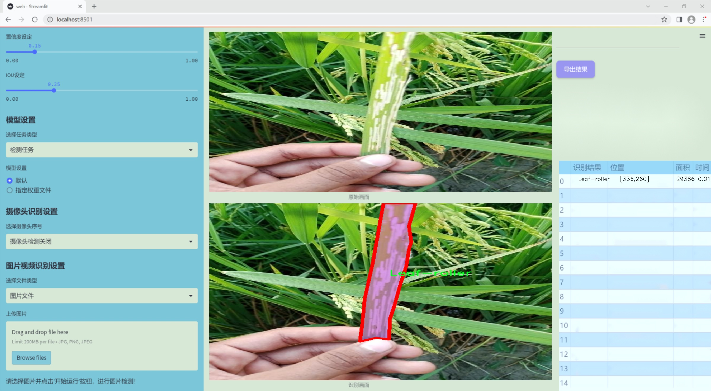
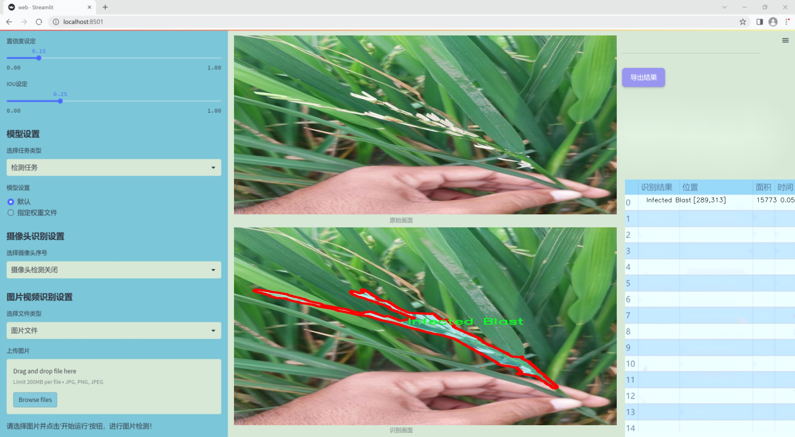
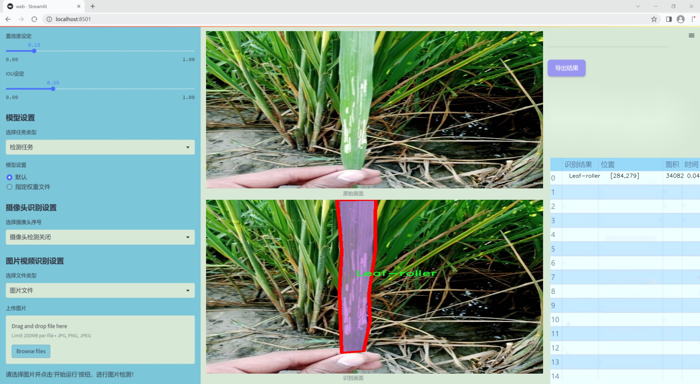
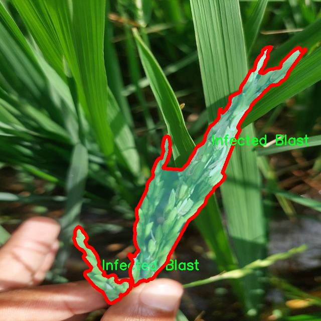
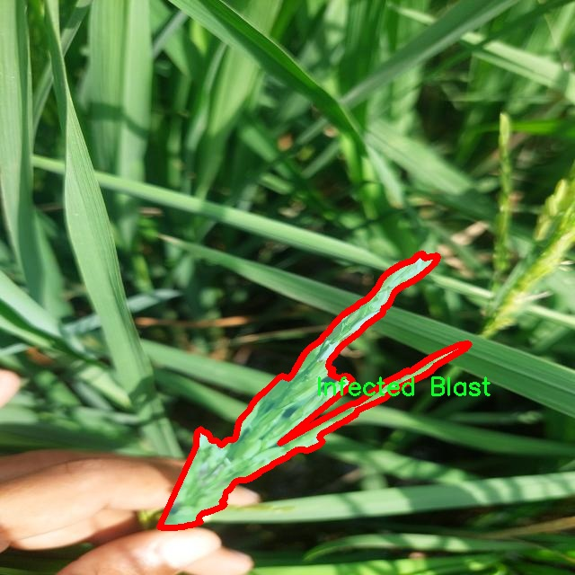
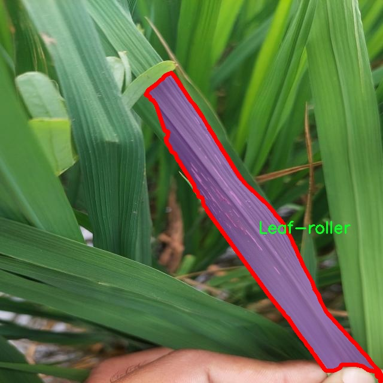

### 1.背景意义

研究背景与意义

随着全球人口的不断增长，农业生产面临着巨大的挑战，尤其是在作物病害的管理和控制方面。农作物病害不仅影响作物的产量和质量，还对农民的经济收入造成了严重影响。因此，开发高效、准确的病害检测系统显得尤为重要。近年来，计算机视觉技术的迅猛发展为农业病害检测提供了新的解决方案。基于深度学习的目标检测模型，尤其是YOLO（You Only Look Once）系列模型，因其在实时检测和高精度方面的优势，成为了研究的热点。

本研究旨在基于改进的YOLOv11模型，构建一个针对农作物病害的检测系统。我们使用的数据集包含1700张图像，涵盖了六种主要的病害类别，包括细菌性穗腐病、假黑穗病、健康水稻叶、健康水稻粒、感染性稻瘟病和叶螟。这些类别的选择不仅反映了当前农业生产中常见的病害类型，也为模型的训练提供了丰富的样本数据。通过对这些图像的实例分割和目标检测，我们希望能够实现对农作物病害的快速识别和分类，从而为农民提供及时的病害预警和管理建议。

此外，随着人工智能技术的不断进步，基于YOLOv11的农作物病害检测系统将能够在实际应用中实现更高的准确性和效率。这不仅有助于提高农业生产的智能化水平，也为实现可持续农业发展提供了技术支持。通过本研究，我们期望能够为农业领域的病害管理提供一种新的思路和方法，推动农业科技的进步和农民收入的增加。

### 2.视频效果

[2.1 视频效果](https://www.bilibili.com/video/BV1t8qVYnEb9/)

### 3.图片效果







##### [项目涉及的源码数据来源链接](https://kdocs.cn/l/cszuIiCKVNis)**

注意：本项目提供训练的数据集和训练教程,由于版本持续更新,暂不提供权重文件（best.pt）,请按照6.训练教程进行训练后实现上图演示的效果。

### 4.数据集信息

##### 4.1 本项目数据集类别数＆类别名

nc: 6
names: ['Bacterial panicle Blight', 'False-Smut', 'Healthy Rice Leaf', 'Healthy Rice beads', 'Infected Blast', 'Leaf-roller']


该项目为【图像分割】数据集，请在【训练教程和Web端加载模型教程（第三步）】这一步的时候按照【图像分割】部分的教程来训练

##### 4.2 本项目数据集信息介绍

本项目数据集信息介绍

本项目旨在改进YOLOv11的农作物病害检测系统，所使用的数据集专注于农业领域，特别是水稻病害的识别与分类。该数据集包含六个主要类别，涵盖了水稻在生长过程中可能遭遇的各种病害及健康状态。这些类别包括“Bacterial panicle Blight”（细菌性穗腐病）、“False-Smut”（假黑穗病）、“Healthy Rice Leaf”（健康水稻叶）、“Healthy Rice beads”（健康水稻珠）、“Infected Blast”（稻瘟病）以及“Leaf-roller”（叶螟）。通过对这些类别的细致划分，数据集不仅为模型提供了丰富的训练样本，也为后续的病害检测提供了明确的目标和参考。

在数据集的构建过程中，特别注重样本的多样性和代表性，以确保模型在实际应用中具备良好的泛化能力。每个类别的样本均经过精心挑选，确保涵盖不同生长阶段、不同环境条件下的表现。这种多样性不仅有助于提升模型的准确性，还能增强其对各种病害的识别能力，从而在实际农业生产中发挥更大的作用。

此外，数据集的标注过程也遵循严格的标准，确保每个样本的标签准确无误。通过这种方式，研究团队能够有效地训练和验证YOLOv11模型，提升其在农作物病害检测中的性能。随着农业技术的不断进步，利用深度学习方法进行病害检测将成为未来农业管理的重要工具，而本项目的数据集正是实现这一目标的重要基础。通过不断优化和扩展数据集，我们期望能够为农业生产提供更为精准和高效的病害检测解决方案。








### 5.全套项目环境部署视频教程（零基础手把手教学）

[5.1 所需软件PyCharm和Anaconda安装教程（第一步）](https://www.bilibili.com/video/BV1BoC1YCEKi/?spm_id_from=333.999.0.0&vd_source=bc9aec86d164b67a7004b996143742dc)


[5.2 安装Python虚拟环境创建和依赖库安装视频教程（第二步）](https://www.bilibili.com/video/BV1ZoC1YCEBw?spm_id_from=333.788.videopod.sections&vd_source=bc9aec86d164b67a7004b996143742dc)

### 6.改进YOLOv11训练教程和Web_UI前端加载模型教程（零基础手把手教学）

[6.1 改进YOLOv11训练教程和Web_UI前端加载模型教程（第三步）](https://www.bilibili.com/video/BV1BoC1YCEhR?spm_id_from=333.788.videopod.sections&vd_source=bc9aec86d164b67a7004b996143742dc)


按照上面的训练视频教程链接加载项目提供的数据集，运行train.py即可开始训练



     Epoch   gpu_mem       box       obj       cls    labels  img_size
     1/200     20.8G   0.01576   0.01955  0.007536        22      1280: 100%|██████████| 849/849 [14:42<00:00,  1.04s/it]
               Class     Images     Labels          P          R     mAP@.5 mAP@.5:.95: 100%|██████████| 213/213 [01:14<00:00,  2.87it/s]
                 all       3395      17314      0.994      0.957      0.0957      0.0843

     Epoch   gpu_mem       box       obj       cls    labels  img_size
     2/200     20.8G   0.01578   0.01923  0.007006        22      1280: 100%|██████████| 849/849 [14:44<00:00,  1.04s/it]
               Class     Images     Labels          P          R     mAP@.5 mAP@.5:.95: 100%|██████████| 213/213 [01:12<00:00,  2.95it/s]
                 all       3395      17314      0.996      0.956      0.0957      0.0845

     Epoch   gpu_mem       box       obj       cls    labels  img_size
     3/200     20.8G   0.01561    0.0191  0.006895        27      1280: 100%|██████████| 849/849 [10:56<00:00,  1.29it/s]
               Class     Images     Labels          P          R     mAP@.5 mAP@.5:.95: 100%|███████   | 187/213 [00:52<00:00,  4.04it/s]
                 all       3395      17314      0.996      0.957      0.0957      0.0845


###### [项目数据集下载链接](https://kdocs.cn/l/cszuIiCKVNis)

### 7.原始YOLOv11算法讲解

##### YOLO11简介

> YOLO11源码地址：https://github.com/ultralytics/ultralytics

Ultralytics
YOLO11是一款尖端的、最先进的模型，它在之前YOLO版本成功的基础上进行了构建，并引入了新功能和改进，以进一步提升性能和灵活性。YOLO11设计快速、准确且易于使用，使其成为各种物体检测和跟踪、实例分割、图像分类以及姿态估计任务的绝佳选择。  


**YOLO11创新点如下:**

YOLO 11主要改进包括：  
`增强的特征提取`：YOLO 11采用了改进的骨干和颈部架构，增强了特征提取功能，以实现更精确的目标检测。  
`优化的效率和速度`：优化的架构设计和优化的训练管道提供更快的处理速度，同时保持准确性和性能之间的平衡。  
`更高的精度，更少的参数`：YOLO11m在COCO数据集上实现了更高的平均精度（mAP），参数比YOLOv8m少22%，使其在不影响精度的情况下提高了计算效率。  
`跨环境的适应性`：YOLO 11可以部署在各种环境中，包括边缘设备、云平台和支持NVIDIA GPU的系统。  
`广泛的支持任务`：YOLO 11支持各种计算机视觉任务，如对象检测、实例分割、图像分类、姿态估计和面向对象检测（OBB）。

**YOLO11不同模型尺寸信息：**

YOLO11 提供5种不同的型号规模模型，以满足不同的应用需求：

Model| size (pixels)| mAPval 50-95| Speed CPU ONNX (ms)| Speed T4 TensorRT10
(ms)| params (M)| FLOPs (B)  
---|---|---|---|---|---|---  
YOLO11n| 640| 39.5| 56.1 ± 0.8| 1.5 ± 0.0| 2.6| 6.5  
YOLO11s| 640| 47.0| 90.0 ± 1.2| 2.5 ± 0.0| 9.4| 21.5  
YOLO11m| 640| 51.5| 183.2 ± 2.0| 4.7 ± 0.1| 20.1| 68.0  
YOLO11l| 640| 53.4| 238.6 ± 1.4| 6.2 ± 0.1| 25.3| 86.9  
YOLO11x| 640| 54.7| 462.8 ± 6.7| 11.3 ± 0.2| 56.9| 194.9  
  
**模型常用训练超参数参数说明：**  
`YOLOv11
模型的训练设置包括训练过程中使用的各种超参数和配置`。这些设置会影响模型的性能、速度和准确性。关键的训练设置包括批量大小、学习率、动量和权重衰减。此外，优化器、损失函数和训练数据集组成的选择也会影响训练过程。对这些设置进行仔细的调整和实验对于优化性能至关重要。  
**以下是一些常用的模型训练参数和说明：**

参数名| 默认值| 说明  
---|---|---  
`model`| `None`| 指定用于训练的模型文件。接受指向 `.pt` 预训练模型或 `.yaml`
配置文件。对于定义模型结构或初始化权重至关重要。  
`data`| `None`| 数据集配置文件的路径（例如
`coco8.yaml`).该文件包含特定于数据集的参数，包括训练数据和验证数据的路径、类名和类数。  
`epochs`| `100`| 训练总轮数。每个epoch代表对整个数据集进行一次完整的训练。调整该值会影响训练时间和模型性能。  
`patience`| `100`| 在验证指标没有改善的情况下，提前停止训练所需的epoch数。当性能趋于平稳时停止训练，有助于防止过度拟合。  
`batch`| `16`| 批量大小，有三种模式:设置为整数(例如，’ Batch =16 ‘)， 60% GPU内存利用率的自动模式(’ Batch
=-1 ‘)，或指定利用率分数的自动模式(’ Batch =0.70 ')。  
`imgsz`| `640`| 用于训练的目标图像尺寸。所有图像在输入模型前都会被调整到这一尺寸。影响模型精度和计算复杂度。  
`device`| `None`| 指定用于训练的计算设备：单个 GPU (`device=0`）、多个 GPU (`device=0,1`)、CPU
(`device=cpu`)，或苹果芯片的 MPS (`device=mps`).  
`workers`| `8`| 加载数据的工作线程数（每 `RANK` 多 GPU 训练）。影响数据预处理和输入模型的速度，尤其适用于多 GPU 设置。  
`name`| `None`| 训练运行的名称。用于在项目文件夹内创建一个子目录，用于存储训练日志和输出结果。  
`pretrained`| `True`| 决定是否从预处理模型开始训练。可以是布尔值，也可以是加载权重的特定模型的字符串路径。提高训练效率和模型性能。  
`optimizer`| `'auto'`| 为训练模型选择优化器。选项包括 `SGD`, `Adam`, `AdamW`, `NAdam`,
`RAdam`, `RMSProp` 等，或 `auto` 用于根据模型配置进行自动选择。影响收敛速度和稳定性  
`lr0`| `0.01`| 初始学习率（即 `SGD=1E-2`, `Adam=1E-3`) .调整这个值对优化过程至关重要，会影响模型权重的更新速度。  
`lrf`| `0.01`| 最终学习率占初始学习率的百分比 = (`lr0 * lrf`)，与调度程序结合使用，随着时间的推移调整学习率。  


**各损失函数作用说明：**  
`定位损失box_loss`：预测框与标定框之间的误差（GIoU），越小定位得越准；  
`分类损失cls_loss`：计算锚框与对应的标定分类是否正确，越小分类得越准；  
`动态特征损失（dfl_loss）`：DFLLoss是一种用于回归预测框与目标框之间距离的损失函数。在计算损失时，目标框需要缩放到特征图尺度，即除以相应的stride，并与预测的边界框计算Ciou
Loss，同时与预测的anchors中心点到各边的距离计算回归DFLLoss。  


### 8.200+种全套改进YOLOV11创新点原理讲解

#### 8.1 200+种全套改进YOLOV11创新点原理讲解大全

由于篇幅限制，每个创新点的具体原理讲解就不全部展开，具体见下列网址中的改进模块对应项目的技术原理博客网址【Blog】（创新点均为模块化搭建，原理适配YOLOv5~YOLOv11等各种版本）

[改进模块技术原理博客【Blog】网址链接](https://gitee.com/qunmasj/good)


#### 8.2 精选部分改进YOLOV11创新点原理讲解

###### 这里节选部分改进创新点展开原理讲解(完整的改进原理见上图和[改进模块技术原理博客链接](https://gitee.com/qunmasj/good)【如果此小节的图加载失败可以通过CSDN或者Github搜索该博客的标题访问原始博客，原始博客图片显示正常】


### 感受野注意力卷积（RFAConv)
#### 标准卷积操作回顾
标准的卷积操作是构造卷积神经网络的基本构件。它利用具有共享参数的滑动窗口提取特征信息，克服了全连通层构造神经网络固有的参数多、计算开销大的问题。设 X R∈C×H×W
表示输入特征图，其中C、H、W分别表示特征图的通道数、高度、宽度。为了清楚地演示卷积核的特征提取过程，我们使用 C = 1 的例子。从每个接受域滑块中提取特征信息的卷积运算可以表示为:


这里，Fi 表示计算后每个卷积滑块得到的值，Xi 表示每个滑块内对应位置的像素值，K表示卷积核，S表示卷积核中的参数个数，N表示接收域滑块的总数。可以看出，每个滑块内相同位置的 feature共享相同的参数Ki。因此，标准的卷积运算并不能捕捉到不同位置所带来的信息差异，这最终在一定程度上限制了卷积神经网络的性能。 

#### 空间注意力回顾
目前，空间注意机制是利用学习得到的注意图来突出每个特征的重要性。与前一节类似，这里以 C=1为例。突出关键特征的空间注意机制可以简单表述为:这里，Fi 表示加权运算后得到的值。xi 和Ai 表示输入特征图和学习到的注意图在不同位置的值，N为输入特征图的高和宽的乘积，表示像素值的总数。


#### 空间注意与标准卷积运算
将注意力机制整合到卷积神经网络中，可以提高卷积神经网络的性能。通过对标准卷积运算和现有空间注意机制的研究，我们认为空间注意机制有效地克服了卷积神经网络固有的参数共享的局限性。目前卷积神经网络中最常用的核大小是 1 × 1和3 × 3。在引入空间注意机制后，提取特征的卷积操作可以是 1 × 1或3 × 3卷积操作。为了直观地展示这个过程，在 1 × 1卷积运算的前面插入了空间注意机制。通过注意图对输入特征图(Re-weight“×”)进行加权运算，最后通过 1 × 1卷积运算提取接收域的滑块特征信息。整个过程可以简单地表示如下:


 这里卷积核K仅代表一个参数值。如果取A i× ki 的值作为一种新的卷积核参数，有趣的是它解决了 1×1卷积运算提取特征时的参数共享问题。然而，关于空间注意机制的传说到此结束。当空间注意机制被插入到3×3卷积运算前面时。具体情况如下:


如上所述，如果取A的值 i × ki (4)式作为一种新的卷积核参数，完全解决了大规模卷积核的参数共享问题。然而，最重要的一点是，卷积核在提取每个接受域滑块的特征时，会共享一些特征。换句话说，每个接收域滑块内都有一个重叠。仔细分析后会发现A12= a21， a13 = a22， a15 = a24……，在这种情况下，每个滑动窗口共享空间注意力地图的权重。因此，空间注意机制没有考虑整个接受域的空间特征，不能有效地解决大规模卷积核的参数共享问题。因此，空间注意机制的有效性受到限制。 

#### 创新空间注意力和标准卷积操作
该博客提出解决了现有空间注意机制的局限性，为空间处理提供了一种创新的解决方案。受RFA的启发，一系列空间注意机制被开发出来，可以进一步提高卷积神经网络的性能。RFA可以看作是一个轻量级即插即用模块，RFA设计的卷积运算(RFAConv)可以代替标准卷积来提高卷积神经网络的性能。因此，我们预测空间注意机制与标准卷积运算的结合将继续发展，并在未来带来新的突破。
接受域空间特征:为了更好地理解接受域空间特征的概念，我们将提供相关的定义。接收域空间特征是专门为卷积核设计的，并根据核大小动态生成。如图1所示，以3×3卷积核为例。在图1中，“Spatial Feature”指的是原始的Feature map。“接受域空间特征”是空间特征变换后的特征图。

 

由不重叠的滑动窗口组成。当使用 3×3卷积内核提取特征时，接收域空间特征中的每个 3×3大小窗口代表一个接收域滑块。接受域注意卷积(RFAConv):针对接受域的空间特征，我们提出了接受域注意卷积(RFA)。该方法不仅强调了接收域滑块内不同特征的重要性，而且对接收域空间特征进行了优先排序。通过该方法，完全解决了卷积核参数共享的问题。接受域空间特征是根据卷积核的大小动态生成的，因此，RFA是卷积的固定组合，不能与卷积操作的帮助分离，卷积操作同时依赖于RFA来提高性能，因此我们提出了接受场注意卷积(RFAConv)。具有3×3大小的卷积核的RFAConv整体结构如图所示。


目前，最广泛使用的接受域特征提取方法是缓慢的。经过大量的研究，我们开发了一种快速的方法，用分组卷积来代替原来的方法。具体来说，我们利用相应大小的分组卷积来动态生成基于接受域大小的展开特征。尽管与原始的无参数方法(如PyTorch提供的nn.())相比，该方法增加了一些参数，但它的速度要快得多。注意:如前一节所述，当使用 3×3卷积内核提取特征时，接收域空间特征中的每个 3×3大小窗口表示一个接收域滑块。而利用快速分组卷积提取感受野特征后，将原始特征映射为新的特征。最近的研究表明。交互信息可以提高网络性能，如[40,41,42]所示。同样，对于RFAConv来说，通过交互接受域特征信息来学习注意图可以提高网络性能。然而，与每个接收域特征交互会导致额外的计算开销，因此为了最小化计算开销和参数的数量，我们使用AvgPool来聚合每个接收域特征的全局信息。然后，使用 1×1 组卷积操作进行信息交互。最后，我们使用softmax来强调每个特征在接受域特征中的重要性。一般情况下，RFA的计算可以表示为:


这里gi×i 表示一个大小为 i×i的分组卷积，k表示卷积核的大小，Norm表示归一化，X表示输入的特征图，F由注意图 a相乘得到 rf 与转换后的接受域空间特征 Frf。与CBAM和CA不同，RFA能够为每个接受域特征生成注意图。卷积神经网络的性能受到标准卷积操作的限制，因为卷积操作依赖于共享参数，对位置变化带来的信息差异不敏感。然而，RFAConv通过强调接收域滑块中不同特征的重要性，并对接收域空间特征进行优先级排序，可以完全解决这个问题。通过RFA得到的feature map是接受域空间特征，在“Adjust Shape”后没有重叠。因此，学习到的注意图将每个接受域滑块的特征信息聚合起来。换句话说，注意力地图不再共享在每个接受域滑块。这完全弥补了现有 CA和CBAM注意机制的不足。RFA为标准卷积内核提供了显著的好处。而在调整形状后，特征的高度和宽度是 k倍，需要进行 stride = k的k × k卷积运算来提取特征信息。RFA设计的卷积运算RFAConv为卷积带来了良好的增益，对标准卷积进行了创新。
此外，我们认为现有的空间注意机制应该优先考虑接受域空间特征，以提高网络性能。众所周知，基于自注意机制的网络模型[43,44,45]取得了很大的成功，因为它解决了卷积参数共享的问题，并对远程信息进行建模。然而，自注意机制也为模型引入了显著的计算开销和复杂性。我们认为，将现有的空间注意机制的注意力引导到接受场空间特征上，可以以类似于自我注意的方式解决长期信息的参数共享和建模问题。与自我关注相比，这种方法需要的参数和计算资源少得多。答案如下:(1)将以接收场空间特征为中心的空间注意机制与卷积相结合，消除了卷积参数共享的问题。(2)现有的空间注意机制已经考虑了远程信息，可以通过全局平均池或全局最大池的方式获取全局信息，其中明确考虑了远程信息。因此，我们设计了新的 CBAM和CA模型，称为RFCBAM和RFCA，它们专注于接受域空间特征。与RFA类似，使用最终的k × k stride = k 的卷积运算来提取特征信息。这两种新的卷积方法的具体结构如图 3所示，我们称这两种新的卷积操作为 RFCBAMConv和RFCAConv。与原来的CBAM相比，我们在RFCBAM中使用SE attention来代替CAM。因为这样可以减少计算开销。此外，在RFCBAM中，通道注意和空间注意不是分开执行的。相反，它们是同时加权的，使得每个通道获得的注意力地图是不同的。


### 9.系统功能展示

图9.1.系统支持检测结果表格显示

  图9.2.系统支持置信度和IOU阈值手动调节

  图9.3.系统支持自定义加载权重文件best.pt(需要你通过步骤5中训练获得)

  图9.4.系统支持摄像头实时识别

  图9.5.系统支持图片识别

  图9.6.系统支持视频识别

  图9.7.系统支持识别结果文件自动保存

  图9.8.系统支持Excel导出检测结果数据


### 10. YOLOv11核心改进源码讲解

#### 10.1 ui.py

以下是经过简化和注释的核心代码部分：

```python
import sys
import subprocess
from QtFusion.path import abs_path

def run_script(script_path):
    """
    使用当前 Python 环境运行指定的脚本。

    Args:
        script_path (str): 要运行的脚本路径
    """
    # 获取当前 Python 解释器的路径
    python_path = sys.executable

    # 构建运行命令，使用 streamlit 运行指定的脚本
    command = f'"{python_path}" -m streamlit run "{script_path}"'

    # 执行命令并等待其完成
    result = subprocess.run(command, shell=True)
    
    # 检查命令执行结果，如果返回码不为0，则表示出错
    if result.returncode != 0:
        print("脚本运行出错。")

# 主程序入口
if __name__ == "__main__":
    # 获取要运行的脚本的绝对路径
    script_path = abs_path("web.py")

    # 调用函数运行指定的脚本
    run_script(script_path)
```

### 代码说明：
1. **导入模块**：
   - `sys`：用于获取当前 Python 解释器的路径。
   - `subprocess`：用于执行外部命令。
   - `abs_path`：从 `QtFusion.path` 导入的函数，用于获取文件的绝对路径。

2. **`run_script` 函数**：
   - 该函数接收一个脚本路径作为参数，并使用当前 Python 环境运行该脚本。
   - 使用 `sys.executable` 获取当前 Python 解释器的路径。
   - 构建一个命令字符串，使用 `streamlit` 模块运行指定的脚本。
   - 使用 `subprocess.run` 执行命令，并检查返回码以判断脚本是否成功运行。

3. **主程序入口**：
   - 使用 `if __name__ == "__main__":` 确保只有在直接运行该脚本时才会执行以下代码。
   - 调用 `abs_path` 函数获取 `web.py` 的绝对路径。
   - 调用 `run_script` 函数运行指定的脚本。

这个程序文件名为 `ui.py`，主要功能是通过当前的 Python 环境来运行一个指定的脚本，具体是使用 Streamlit 来启动一个 Web 应用。

首先，文件导入了几个必要的模块，包括 `sys`、`os` 和 `subprocess`。其中，`sys` 模块用于访问与 Python 解释器相关的变量和函数，`os` 模块提供了与操作系统交互的功能，而 `subprocess` 模块则用于执行外部命令。

接下来，程序定义了一个名为 `run_script` 的函数，该函数接受一个参数 `script_path`，表示要运行的脚本的路径。在函数内部，首先通过 `sys.executable` 获取当前 Python 解释器的路径，这样可以确保在正确的环境中运行脚本。然后，构建一个命令字符串，该命令使用 Streamlit 来运行指定的脚本。具体的命令格式为 `"{python_path}" -m streamlit run "{script_path}"`，其中 `{python_path}` 和 `{script_path}` 会被实际的路径替换。

使用 `subprocess.run` 方法执行构建好的命令，并通过 `shell=True` 参数允许在 shell 中执行该命令。执行后，程序检查返回的结果码，如果结果码不为 0，表示脚本运行出错，程序会打印出错误信息。

在文件的最后部分，使用 `if __name__ == "__main__":` 语句来确保当该文件作为主程序运行时，以下代码才会被执行。这里指定了要运行的脚本路径，调用 `abs_path` 函数来获取 `web.py` 的绝对路径。最后，调用 `run_script` 函数来运行这个脚本。

总的来说，这个程序的主要目的是为了方便地启动一个基于 Streamlit 的 Web 应用，通过封装在 `run_script` 函数中的逻辑，用户只需指定脚本路径即可。

#### 10.2 lsknet.py

以下是经过简化和注释的核心代码部分：

```python
import torch
import torch.nn as nn
from functools import partial

class Mlp(nn.Module):
    """多层感知机（MLP）模块，包含卷积层和激活函数"""
    def __init__(self, in_features, hidden_features=None, out_features=None, act_layer=nn.GELU, drop=0.):
        super().__init__()
        out_features = out_features or in_features  # 输出特征数
        hidden_features = hidden_features or in_features  # 隐藏层特征数
        self.fc1 = nn.Conv2d(in_features, hidden_features, 1)  # 第一层卷积
        self.dwconv = DWConv(hidden_features)  # 深度卷积
        self.act = act_layer()  # 激活函数
        self.fc2 = nn.Conv2d(hidden_features, out_features, 1)  # 第二层卷积
        self.drop = nn.Dropout(drop)  # Dropout层

    def forward(self, x):
        """前向传播"""
        x = self.fc1(x)
        x = self.dwconv(x)
        x = self.act(x)
        x = self.drop(x)
        x = self.fc2(x)
        x = self.drop(x)
        return x


class Attention(nn.Module):
    """注意力模块"""
    def __init__(self, d_model):
        super().__init__()
        self.proj_1 = nn.Conv2d(d_model, d_model, 1)  # 投影层1
        self.activation = nn.GELU()  # 激活函数
        self.spatial_gating_unit = LSKblock(d_model)  # 空间门控单元
        self.proj_2 = nn.Conv2d(d_model, d_model, 1)  # 投影层2

    def forward(self, x):
        """前向传播"""
        shortcut = x.clone()  # 残差连接
        x = self.proj_1(x)
        x = self.activation(x)
        x = self.spatial_gating_unit(x)
        x = self.proj_2(x)
        x = x + shortcut  # 加上残差
        return x


class Block(nn.Module):
    """基本块，包含注意力和MLP"""
    def __init__(self, dim, mlp_ratio=4., drop=0., drop_path=0., act_layer=nn.GELU):
        super().__init__()
        self.norm1 = nn.BatchNorm2d(dim)  # 第一层归一化
        self.norm2 = nn.BatchNorm2d(dim)  # 第二层归一化
        self.attn = Attention(dim)  # 注意力模块
        self.mlp = Mlp(in_features=dim, hidden_features=int(dim * mlp_ratio), act_layer=act_layer, drop=drop)  # MLP模块

    def forward(self, x):
        """前向传播"""
        x = x + self.attn(self.norm1(x))  # 添加注意力输出
        x = x + self.mlp(self.norm2(x))  # 添加MLP输出
        return x


class LSKNet(nn.Module):
    """LSKNet模型"""
    def __init__(self, img_size=224, in_chans=3, embed_dims=[64, 128, 256, 512], depths=[3, 4, 6, 3]):
        super().__init__()
        self.num_stages = len(depths)  # 模型阶段数

        for i in range(self.num_stages):
            # 初始化每个阶段的嵌入和块
            self.add_module(f"block{i + 1}", nn.ModuleList([Block(dim=embed_dims[i]) for _ in range(depths[i])]))

    def forward(self, x):
        """前向传播"""
        for i in range(self.num_stages):
            block = getattr(self, f"block{i + 1}")
            for blk in block:
                x = blk(x)  # 逐层通过块
        return x


class DWConv(nn.Module):
    """深度卷积模块"""
    def __init__(self, dim=768):
        super(DWConv, self).__init__()
        self.dwconv = nn.Conv2d(dim, dim, 3, 1, 1, bias=True, groups=dim)  # 深度卷积

    def forward(self, x):
        """前向传播"""
        return self.dwconv(x)


def lsknet_t(weights=''):
    """构建LSKNet_t模型"""
    model = LSKNet(embed_dims=[32, 64, 160, 256], depths=[3, 3, 5, 2])
    if weights:
        model.load_state_dict(torch.load(weights)['state_dict'])  # 加载权重
    return model


if __name__ == '__main__':
    model = lsknet_t('lsk_t_backbone-2ef8a593.pth')  # 实例化模型
    inputs = torch.randn((1, 3, 640, 640))  # 随机输入
    output = model(inputs)  # 模型前向传播
    print(output.size())  # 输出尺寸
```

### 代码注释说明：
1. **Mlp类**：实现了一个多层感知机，包含卷积层、深度卷积、激活函数和Dropout。
2. **Attention类**：实现了一个注意力机制，包含两个投影层和一个空间门控单元。
3. **Block类**：实现了基本的网络块，包含注意力和MLP模块，使用残差连接。
4. **LSKNet类**：实现了整个网络结构，包含多个阶段的块。
5. **DWConv类**：实现了深度卷积，用于特征提取。
6. **lsknet_t函数**：用于构建LSKNet_t模型并加载预训练权重。

该代码的核心部分主要集中在网络结构的定义和前向传播逻辑上。

这个程序文件 `lsknet.py` 实现了一个名为 LSKNet 的深度学习模型，主要用于图像处理任务。该模型由多个模块组成，包括 Mlp、LSKblock、Attention、Block、OverlapPatchEmbed、DWConv 等。下面是对代码的详细说明。

首先，程序导入了必要的库，包括 PyTorch 和一些辅助函数。`__all__` 定义了模块的公共接口，表示可以被外部导入的内容。

`Mlp` 类实现了一个多层感知机（MLP），包含两个卷积层和一个深度可分离卷积（DWConv）。在前向传播中，输入经过两个卷积层和激活函数（GELU），并在每个卷积后应用 dropout。

`LSKblock` 类是一个核心模块，使用了深度可分离卷积和空间卷积来生成注意力特征。它通过对输入进行两次卷积操作，生成两个特征图，然后通过平均和最大池化操作合并这两个特征图，最后使用 Sigmoid 激活函数生成注意力权重，并对输入进行加权。

`Attention` 类实现了一个注意力机制，包含两个卷积层和一个 LSKblock。它通过对输入进行线性变换和激活，接着应用 LSKblock，最后将结果与输入相加以形成残差连接。

`Block` 类是一个包含注意力机制和 MLP 的模块。它首先对输入进行归一化，然后通过注意力层和 MLP 进行处理，最后将结果与输入相加以形成残差连接。这里还使用了层级缩放参数来增强模型的稳定性。

`OverlapPatchEmbed` 类用于将输入图像分割成重叠的块，并将其嵌入到一个更高维的空间中。它使用卷积层来实现这一点，并在输出后进行归一化。

`LSKNet` 类是整个模型的主体，包含多个阶段，每个阶段由一个重叠的块嵌入层、多个 Block 组成和一个归一化层。模型的深度和嵌入维度可以通过参数进行调整。模型的前向传播过程包括对输入进行嵌入、经过多个 Block 处理，然后进行归一化，最后输出特征图。

`DWConv` 类实现了深度可分离卷积，用于在 LSKblock 中提取特征。

`update_weight` 函数用于更新模型的权重，从给定的权重字典中加载匹配的权重。

`lsknet_t` 和 `lsknet_s` 函数分别创建 LSKNet 的两个不同版本，并可选择加载预训练权重。

最后，在主程序中，创建了一个 LSKNet 模型实例，并通过随机生成的输入数据进行测试，打印出每个阶段输出的特征图的尺寸。

总体来说，这个程序实现了一个复杂的图像处理模型，结合了多种深度学习技术，适用于各种计算机视觉任务。

#### 10.3 rep_block.py

以下是保留的核心代码部分，并附上详细的中文注释：

```python
import torch
import torch.nn as nn
import torch.nn.functional as F

def transI_fusebn(kernel, bn):
    """
    将卷积核和批归一化层的参数融合，返回融合后的卷积核和偏置。
    """
    gamma = bn.weight  # 获取批归一化的缩放因子
    std = (bn.running_var + bn.eps).sqrt()  # 计算标准差
    # 融合卷积核和批归一化参数
    return kernel * ((gamma / std).reshape(-1, 1, 1, 1)), bn.bias - bn.running_mean * gamma / std

def conv_bn(in_channels, out_channels, kernel_size, stride=1, padding=0, dilation=1, groups=1):
    """
    创建一个卷积层和一个批归一化层的组合。
    """
    conv_layer = nn.Conv2d(in_channels=in_channels, out_channels=out_channels, kernel_size=kernel_size,
                           stride=stride, padding=padding, dilation=dilation, groups=groups,
                           bias=False)  # 创建卷积层，不使用偏置
    bn_layer = nn.BatchNorm2d(num_features=out_channels, affine=True)  # 创建批归一化层
    return nn.Sequential(conv_layer, bn_layer)  # 返回组合的层

class DiverseBranchBlock(nn.Module):
    def __init__(self, in_channels, out_channels, kernel_size, stride=1, padding=None, dilation=1, groups=1):
        """
        初始化DiverseBranchBlock模块，包含多个分支的卷积操作。
        """
        super(DiverseBranchBlock, self).__init__()
        self.kernel_size = kernel_size
        self.in_channels = in_channels
        self.out_channels = out_channels
        self.groups = groups
        
        if padding is None:
            padding = kernel_size // 2  # 默认填充为卷积核大小的一半

        # 原始卷积和批归一化
        self.dbb_origin = conv_bn(in_channels=in_channels, out_channels=out_channels, kernel_size=kernel_size,
                                  stride=stride, padding=padding, dilation=dilation, groups=groups)

        # 平均池化分支
        self.dbb_avg = nn.Sequential(
            nn.Conv2d(in_channels=in_channels, out_channels=out_channels, kernel_size=1, stride=1, padding=0, groups=groups, bias=False),
            nn.BatchNorm2d(out_channels),
            nn.AvgPool2d(kernel_size=kernel_size, stride=stride, padding=0)
        )

        # 1x1卷积分支
        self.dbb_1x1_kxk = nn.Sequential(
            nn.Conv2d(in_channels=in_channels, out_channels=out_channels, kernel_size=1, stride=1, padding=0, groups=groups, bias=False),
            nn.BatchNorm2d(out_channels)
        )

    def forward(self, inputs):
        """
        前向传播，计算输出。
        """
        out = self.dbb_origin(inputs)  # 通过原始卷积分支
        out += self.dbb_avg(inputs)  # 加上平均池化分支
        out += self.dbb_1x1_kxk(inputs)  # 加上1x1卷积分支
        return out  # 返回最终输出

    def get_equivalent_kernel_bias(self):
        """
        获取等效的卷积核和偏置，用于部署时的卷积层。
        """
        k_origin, b_origin = transI_fusebn(self.dbb_origin[0].weight, self.dbb_origin[1])  # 融合原始卷积的权重和偏置
        k_avg, b_avg = transI_fusebn(self.dbb_avg[0].weight, self.dbb_avg[1])  # 融合平均池化分支的权重和偏置
        k_1x1, b_1x1 = transI_fusebn(self.dbb_1x1_kxk[0].weight, self.dbb_1x1_kxk[1])  # 融合1x1卷积分支的权重和偏置
        
        # 返回所有分支的卷积核和偏置的总和
        return (k_origin + k_avg + k_1x1), (b_origin + b_avg + b_1x1)

# 示例使用
# block = DiverseBranchBlock(in_channels=64, out_channels=128, kernel_size=3)
# output = block(torch.randn(1, 64, 224, 224))  # 输入一个随机张量
```

### 代码注释说明：
1. **transI_fusebn**: 该函数用于将卷积层的权重与批归一化层的参数融合，以便在推理时简化计算。
2. **conv_bn**: 该函数创建一个包含卷积层和批归一化层的组合模块，便于后续使用。
3. **DiverseBranchBlock**: 这是一个自定义的神经网络模块，包含多个分支（原始卷积、平均池化和1x1卷积），用于实现多样化的特征提取。
4. **forward**: 定义了模块的前向传播逻辑，计算输入的输出。
5. **get_equivalent_kernel_bias**: 该方法用于获取融合后的卷积核和偏置，适用于模型部署阶段。

这个程序文件 `rep_block.py` 是一个实现多分支卷积块的深度学习模块，主要用于构建复杂的卷积神经网络（CNN）结构。文件中定义了多个类和函数，主要包括 `DiverseBranchBlock`、`WideDiverseBranchBlock` 和 `DeepDiverseBranchBlock`，它们都继承自 `torch.nn.Module`，并实现了不同的卷积操作。

首先，文件导入了必要的库，包括 `torch` 和 `torch.nn`，以及一些自定义的卷积模块和功能函数。接下来，定义了一些用于卷积和批归一化的转换函数，这些函数主要用于处理卷积核和偏置的融合、分支的合并等操作。

`conv_bn` 函数用于创建一个包含卷积层和批归一化层的序列模块，方便后续的使用。`IdentityBasedConv1x1` 类实现了一个特殊的 1x1 卷积层，确保在特定条件下保留输入的特征。

`BNAndPadLayer` 类实现了一个结合批归一化和填充的层，能够在进行批归一化后，对输出进行填充处理，以保持特征图的尺寸。

`DiverseBranchBlock` 类是一个多分支卷积块的实现，包含多个分支的卷积操作，包括常规卷积、1x1 卷积和平均池化等。该类的构造函数中根据输入参数初始化不同的卷积层和批归一化层，并提供了切换到部署模式的方法，以便在推理时使用融合后的卷积核和偏置。

`DiverseBranchBlockNOAct` 类是一个没有激活函数的多分支卷积块实现，适用于某些特定的网络结构。`DeepDiverseBranchBlock` 类则在 `DiverseBranchBlock` 的基础上进行了扩展，增加了更多的卷积操作和分支，以提高模型的表达能力。

`WideDiverseBranchBlock` 类实现了宽卷积块，支持在训练过程中进行垂直和水平卷积的操作，以增强模型对不同方向特征的捕捉能力。

每个类都实现了 `forward` 方法，用于定义前向传播的计算过程。此外，许多类还实现了初始化权重和偏置的方法，以便在训练开始时设置合适的初始值。

总的来说，这个文件提供了一种灵活的方式来构建复杂的卷积神经网络结构，支持多种卷积操作和分支设计，适用于各种计算机视觉任务。

#### 10.4 efficientViT.py

以下是经过简化和注释的核心代码部分，保留了 EfficientViT 模型的主要结构和功能。

```python
import torch
import torch.nn as nn
import torch.nn.functional as F
from timm.models.layers import SqueezeExcite

# 定义卷积层和批归一化的组合
class Conv2d_BN(torch.nn.Sequential):
    def __init__(self, in_channels, out_channels, kernel_size=1, stride=1, padding=0):
        super().__init__()
        # 添加卷积层
        self.add_module('conv', nn.Conv2d(in_channels, out_channels, kernel_size, stride, padding, bias=False))
        # 添加批归一化层
        self.add_module('bn', nn.BatchNorm2d(out_channels))

    @torch.no_grad()
    def switch_to_deploy(self):
        # 将训练模式下的层转换为推理模式下的层
        conv, bn = self._modules.values()
        w = bn.weight / (bn.running_var + bn.eps)**0.5
        w = conv.weight * w[:, None, None, None]
        b = bn.bias - bn.running_mean * bn.weight / (bn.running_var + bn.eps)**0.5
        return nn.Conv2d(w.size(1), w.size(0), w.shape[2:], stride=conv.stride, padding=conv.padding, bias=True).to(w.device).copy_(w), b

# 定义高效的 ViT 模块
class EfficientViTBlock(torch.nn.Module):
    def __init__(self, embed_dim, key_dim, num_heads=8):
        super().__init__()
        # 残差卷积层
        self.dw = nn.Sequential(
            Conv2d_BN(embed_dim, embed_dim, kernel_size=3, stride=1, padding=1, groups=embed_dim),
            nn.ReLU()
        )
        # 前馈网络
        self.ffn = nn.Sequential(
            Conv2d_BN(embed_dim, embed_dim * 2, kernel_size=1),
            nn.ReLU(),
            Conv2d_BN(embed_dim * 2, embed_dim, kernel_size=1)
        )
        # 局部窗口注意力
        self.attn = LocalWindowAttention(embed_dim, key_dim, num_heads)

    def forward(self, x):
        # 前向传播
        x = self.dw(x) + x  # 残差连接
        x = self.attn(x) + x  # 注意力连接
        x = self.ffn(x) + x  # 前馈网络连接
        return x

# 定义局部窗口注意力机制
class LocalWindowAttention(torch.nn.Module):
    def __init__(self, dim, key_dim, num_heads=8):
        super().__init__()
        self.attn = CascadedGroupAttention(dim, key_dim, num_heads)

    def forward(self, x):
        return self.attn(x)

# 定义高效的 ViT 模型
class EfficientViT(torch.nn.Module):
    def __init__(self, img_size=224, embed_dim=[64, 128, 192], depth=[1, 2, 3], num_heads=[4, 4, 4]):
        super().__init__()
        self.patch_embed = nn.Sequential(
            Conv2d_BN(3, embed_dim[0] // 8, kernel_size=3, stride=2, padding=1),
            nn.ReLU(),
            Conv2d_BN(embed_dim[0] // 8, embed_dim[0] // 4, kernel_size=3, stride=2, padding=1),
            nn.ReLU()
        )
        # 定义多个块
        self.blocks = nn.ModuleList()
        for i in range(len(depth)):
            for _ in range(depth[i]):
                self.blocks.append(EfficientViTBlock(embed_dim[i], key_dim=16, num_heads=num_heads[i]))

    def forward(self, x):
        x = self.patch_embed(x)
        for block in self.blocks:
            x = block(x)
        return x

# 示例模型实例化
if __name__ == '__main__':
    model = EfficientViT()
    inputs = torch.randn((1, 3, 224, 224))  # 输入一个224x224的图像
    output = model(inputs)
    print(output.size())  # 输出特征图的尺寸
```

### 代码注释说明：
1. **Conv2d_BN**: 这个类定义了一个卷积层和批归一化层的组合，便于构建高效的卷积神经网络。
2. **EfficientViTBlock**: 这是高效 ViT 模型的基本构建块，包含残差卷积、前馈网络和局部窗口注意力机制。
3. **LocalWindowAttention**: 该类实现了局部窗口注意力机制，利用注意力机制增强特征表示。
4. **EfficientViT**: 这是整个高效 ViT 模型的定义，包含多个块的堆叠和图像的嵌入处理。
5. **主程序**: 在主程序中实例化模型并传入一个随机生成的输入张量，输出特征图的尺寸。

以上代码为 EfficientViT 模型的核心部分，去除了冗余部分，保留了主要功能并进行了详细注释。

这个程序文件实现了一个高效的视觉变换器（EfficientViT）模型架构，旨在用于下游任务。代码中定义了多个类和函数，构成了整个模型的结构。

首先，程序导入了必要的库，包括PyTorch及其相关模块。接着，定义了一个名为`Conv2d_BN`的类，该类继承自`torch.nn.Sequential`，用于创建一个包含卷积层和批归一化层的组合。它的构造函数中设置了卷积层的参数，并初始化了批归一化层的权重和偏置。该类还提供了一个`switch_to_deploy`方法，用于在推理时将卷积层和批归一化层融合，以提高推理效率。

接下来，定义了一个`replace_batchnorm`函数，用于替换模型中的批归一化层为恒等映射，以便在推理时减少计算开销。

`PatchMerging`类实现了一个用于合并图像块的模块，包含多个卷积层和激活函数。它通过逐层处理输入，最终输出合并后的特征图。

`Residual`类实现了残差连接的功能，允许在训练时随机丢弃部分输入，以增强模型的鲁棒性。

`FFN`类实现了前馈神经网络模块，包含两个卷积层和一个ReLU激活函数。

`CascadedGroupAttention`类实现了级联组注意力机制，支持多头注意力和自适应的注意力偏置。该模块通过对输入特征进行分块处理，计算注意力权重，并将其应用于输入特征。

`LocalWindowAttention`类实现了局部窗口注意力机制，允许在较小的窗口内计算注意力，从而提高计算效率。

`EfficientViTBlock`类是一个基本的EfficientViT构建块，包含多个卷积层、前馈网络和注意力机制的组合。

`EfficientViT`类是整个模型的核心，负责构建整个网络结构。它首先通过`patch_embed`模块将输入图像嵌入到特征空间中，然后依次通过多个EfficientViT块进行处理。模型的参数包括图像大小、补丁大小、嵌入维度、深度、头数等。

在文件的最后部分，定义了多个不同配置的EfficientViT模型（如`EfficientViT_m0`到`EfficientViT_m5`），并提供了加载预训练权重和替换批归一化层的功能。

最后，程序的主入口部分创建了一个EfficientViT模型实例，并对随机生成的输入进行前向传播，输出每个阶段的特征图尺寸。这一部分展示了如何使用该模型进行推理。

### 11.完整训练+Web前端界面+200+种全套创新点源码、数据集获取


# [下载链接：https://mbd.pub/o/bread/Z5yYkp9y](https://mbd.pub/o/bread/Z5yYkp9y)